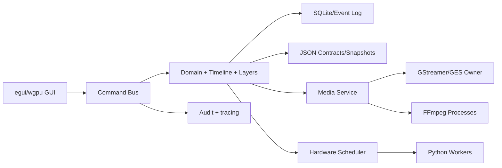
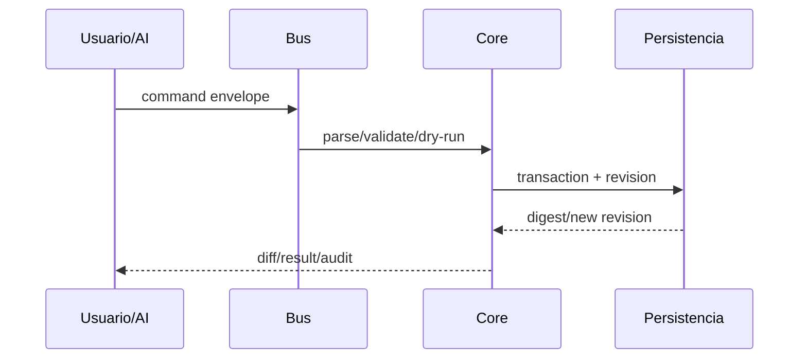
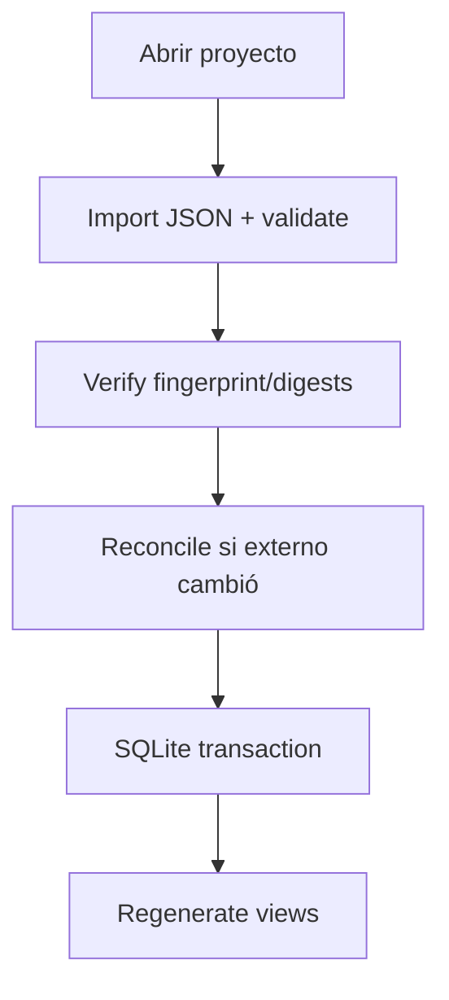
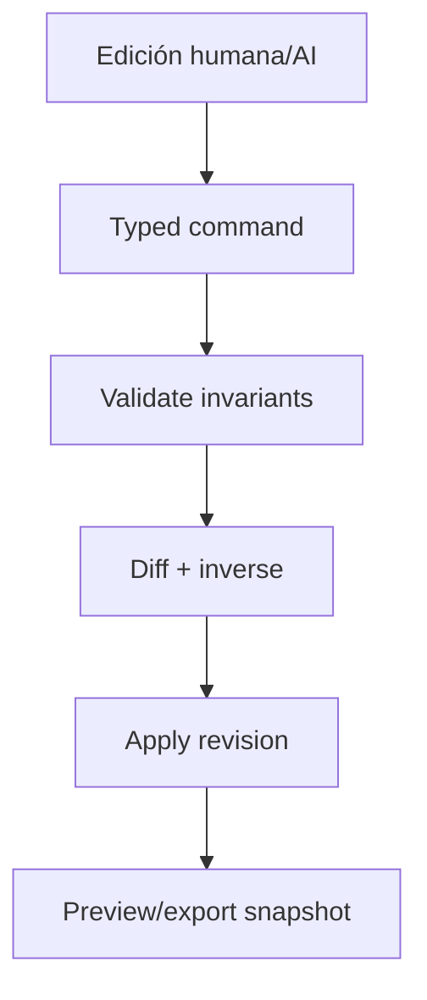
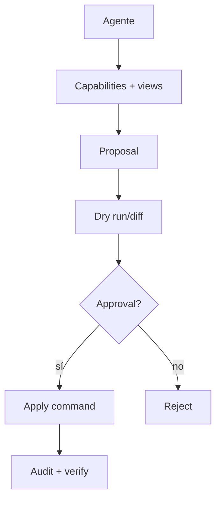
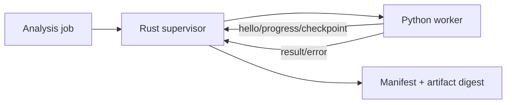
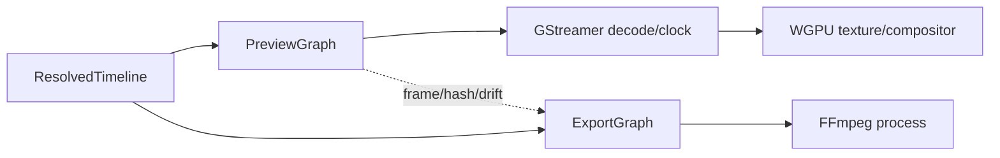
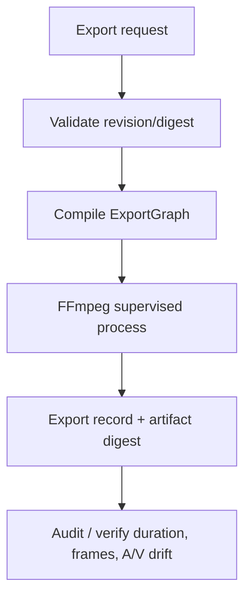
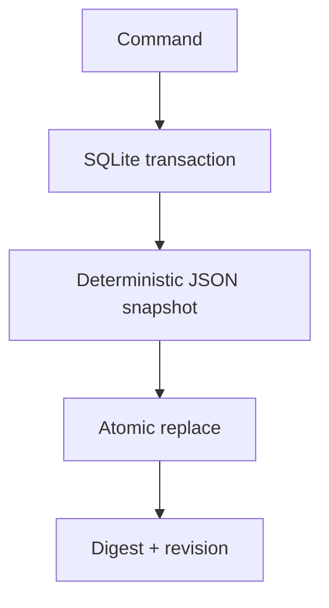
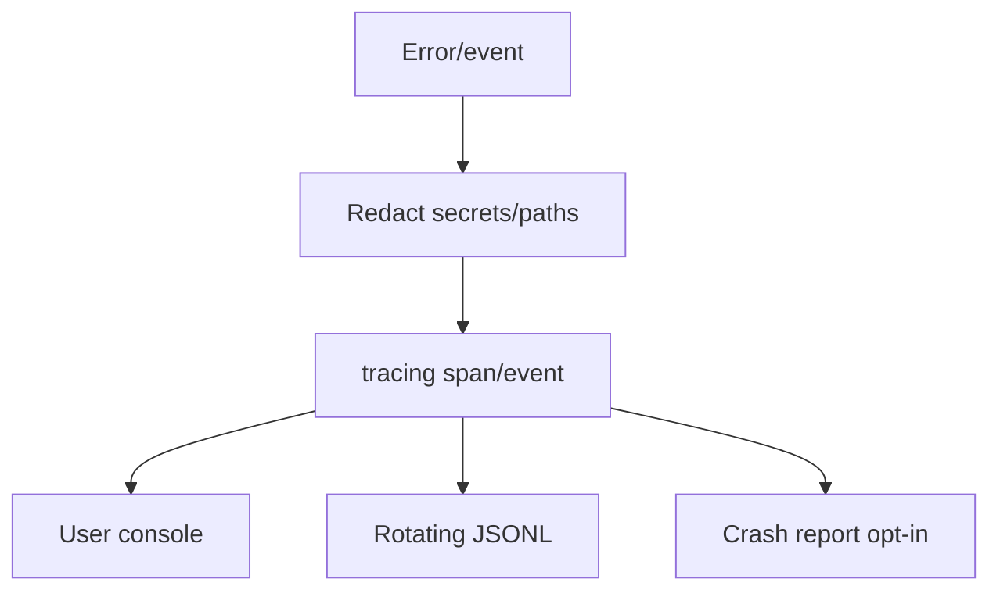

# 21 — Arquitectura fusionada validada

## Decisión de fusión

Conservar contratos y semántica editorial V1; refactorizar UI/orquestación; portar dominio/validación/undo/scheduler a Rust; mantener inferencia Python; usar GStreamer/FFmpeg como servicios aislados; tomar de Cutlass commands/staging, de Gausian crate boundaries/render ideas, de OpenCut/Kdenlive/Shotcut conducta observable y de Kerf diff/queue conceptuales.

## Componentes

## Flujos

## Qué se diseña desde cero

El vínculo clips↔evidencia, `ResolvedTimeline` común preview/export, authority/reconcile SQLite↔JSON, capabilities/risk policy AI, scheduler VRAM/RAM y packaging reproducible. Son piezas sin reutilización segura o con objetivos específicos de Transcriptor.
